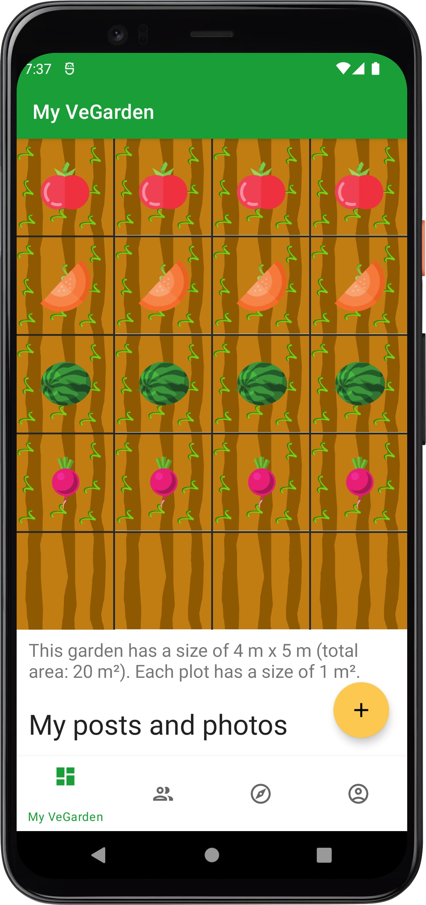

# Social VeGarden

  

This app is a very simple social network focused on vegetable gardens. Users can
post photos and written posts or show other their garden through its digital
representation. It has been developed for the mobile programming course of the
University of Brescia. You can find the technical report [here](Report.pdf).

## Try it out
* Clone the repo
* Create a Firebase project and add the private key to the project
* Enable these services: authentication with email and password, Firestore and
Storage
* Build the project